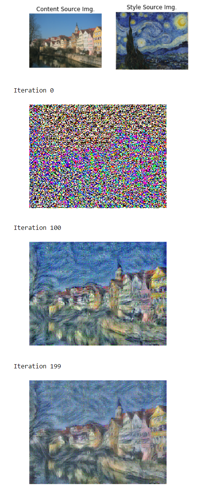
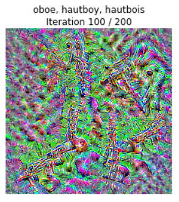
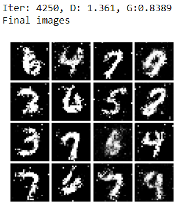

# cs231n

My solutions for this course (Spring 2017).

The course website: http://cs231n.stanford.edu/

- assignment1
  - Q1: k-Nearest Neighbor classifier :white_check_mark: 
  - Q2: Training a Support Vector Machine :white_check_mark: 
  - Q3: Implement a Softmax classifier :white_check_mark: 
  - Q4: Two-Layer Neural Network :white_check_mark: 
  - Q5: Higher Level Representations: Image Features :white_check_mark: 

- assignment2
  - Q1: Fully-connected Neural Network :white_check_mark: 
  - Q2: Batch Normalization :white_check_mark: 
  - Q3: Dropout :white_check_mark: 
  - Q4: Convolutional Networks :white_check_mark: 
  - Q5: PyTorch / TensorFlow on CIFAR-10 :white_check_mark: 

- assignment3
  - Q1: Image Captioning with Vanilla RNNs :white_check_mark: 
  - Q2: Image Captioning with LSTMs :white_check_mark: 
  - Q3: Network Visualization: Saliency maps, Class Visualization, and Fooling Images :white_check_mark: 
  - Q4: Style Transfer :white_check_mark: 
  - Q5: Generative Adversarial Networks :white_check_mark: 

## Screenshots
### Style Transfer

### Class Visualization

### Generative Adversarial Networks

